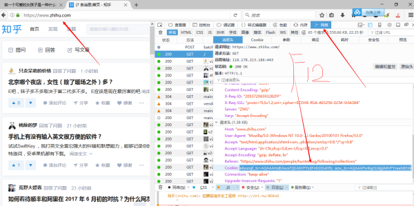
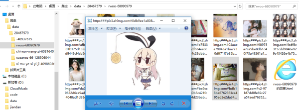
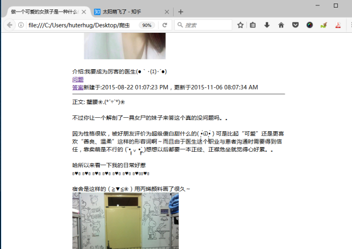

# 一.说明

已实现功能： 

1. 通过单个问题id获取批量答案
2. 通过集合id获取批量问题后获取批量答案
3. 关注别人（风险大容易被封杀去除）
4. 登录(验证码问题去除)

待实现功能：

1. 通过答案id获取单个回答
2. 根据用户唯一域名id获取她（它）他的全部回答（有用，优先级高）
3. 根据用户唯一域名id获取其关系图（关注与被关注：六层网络）

Golang开发的爬虫，入口在main文件夹下，你需要放一个cookie.txt在里面，其实已经写好登录代码，但是知乎突然出现了高级验证码模式，
突破不了，因此使用笨方法。

打开火狐浏览器后人工登录知乎，按F12 ，点击网络，刷新一下首页，然后点击第一个出现的GET /，找到消息头请求头，复制Cookie，然后粘贴到cookie.txt



# 二.使用指南

下载

```
go get -u -v github.com/hunterhug/zhihuxx
```

下载不下来？你不会Git或者Go?请手动下载！此包在哥哥封装的爬虫包基础上开发：[土拨鼠（tubo）](https://github.com/hunterhug/GoSpider)

运行

```
cd main
go run main.go
```

已经为非程序员编译好exe文件，点击即可！

点击EXE后,可选JS解决防盗链（这个是你要发布到自己的网站如：[减肥成功是什么感觉？给生活带来哪些改变？](http://www.lenggirl.com/zhihu/26613082-html/1.html)）
我们自己本地看的话就不要选择防盗链了！回答个数已经限制不大于500个。如果没有答案证明Cookie失效，请手动修改cookie.txt。

单问题模式：

```
zhihu_linux_x86_64 

        -----------------
        知乎问题信息小助手
        功能:
        1. 可选抓取图片
        2. 抓取答案
        3. 可选关注小伙伴

        选项:
        1. 从收藏夹https://www.zhihu.com/collection/78172986批量获取很多问题答案
        2. 从问题https://www.zhihu.com/question/28853910批量获取一个问题很多答案

        请您按提示操作（Enter）！答案保存在data文件夹下！

        因为知乎防盗链，放在你的网站上是看不见图片的！
        但是本地查看是没问题的！可选择防盗链生成HTML

        如果什么都没抓到请往exe同级目录cookie.txt
        增加cookie，手动增加cookie见说明

        你亲爱的萌萌~
        太阳萌飞了~~~
        -----------------
        
萌萌：你要发布到自己的网站上吗(JS解决防盗链)Y/N(默认N)
y
萌萌：要抓取图片吗Y/N(默认N)
n
萌萌：从收藏夹获取按1，从问题获取按2(默认)
2
萌萌说亲爱的，因为回答实在太多，请限制获取的回答个数:30（默认)
499
萌萌：请输入问题ID:
57000057
预抓取第一个回答！
开始处理答案:文末更新了！ 啊我被你们叫小姐姐叫的心都化了！ -- 我174cm 49kg 题主你这个身材超招人羡慕了好吗！ 个子高走什么风格不重要，主要是要简单，简单，简单。 以大面积纯色为主，过多的花纹和图案都会让觉得“巨婴”“傻大个”。款式也是越简单越好，有一些设…
哦，这个问题是:个子较高的女生怎么穿搭？
保存答案成功:data/57000057/chen-jian-guo-he-li-zi-165635365/chen-jian-guo-he-li-zi-165635365的回答.html
批量抓取答案，默认N(Y/N)
y
开始处理答案:5.10号 微博：Chilli-M 这么久了还没沉底儿既然这样大噶多多点赞关注好不啦～ 你们看看排我后头的赞都比我多两倍带拐弯儿！ 争气啊朋友们！ 实在没什么穿搭发 发最近的一点日常 …………………………………………………更新～～ ～～～～～～～～～～～～～…
保存答案成功:data/57000057/ma-tian-jiao-92-155865780/ma-tian-jiao-92-155865780的回答.html

```

上帝模式

```
萌萌：从收藏夹获取按1，从问题获取按2(默认)
1
萌萌说亲爱的，因为回答实在太多，请限制获取的回答个数:30（默认)
499
萌萌：请输入集合ID:
78172986
开启上帝模式吗(一路抓到底)，默认N(Y/N)?
y
抓取收藏夹第1页
抓取收藏夹第2页
抓取收藏夹第3页
...
```

结果：




# 三.编译成执行文件

## Linux下跨平台编译

Linux二进制
```
cd main
go build -ldflags "-s -w" -v -o zhihu_linux_x86_64 main.go
```

Windows二进制
```
GOOS=windows GOARCH=amd64 go build -ldflags "-s -w" -x -o zhihu_windows_amd64.exe main.go 
```

## Windows编译

```
go build -o zhihu.exe main.go
```

# 四.环境配置

## Ubuntu安装

下载源码解压.下载IDE也是解压设置环境变量.

```
vim /etc/profile.d/myenv.sh

export GOROOT=/app/go
export GOPATH=/home/jinhan/code
export GOBIN=$GOROOT/bin
export PATH=.:$PATH:/app/go/bin:$GOPATH/bin:/home/jinhan/software/Gogland-171.3780.106/bin

source /etc/profile.d/myenv.sh
```

## Windows安装

[](https://yun.baidu.com/s/1jHKUGZG) 选择后缀为msi安装如1.6

环境变量设置：

```
Path G:\smartdogo\bin
GOBIN G:\smartdogo\bin
GOPATH G:\smartdogo
GOROOT C:\Go\
```

## docker安装

我们的库可能要使用各种各样的工具，配置连我这种专业人员有时都搞不定，而且还可能会损坏，所以用docker方式随时随地开发。

先拉镜像

```
docker pull golang:1.8
```

Golang环境启动：

```
docker run --rm --net=host -it -v /home/jinhan/code:/go --name mygolang golang:1.8 /bin/bash

root@27214c6216f5:/go# go env
GOARCH="amd64"
```

其中`/home/jinhan/code`为你自己的本地文件夹（虚拟GOPATH），你在docker内`go get`产生在`/go`的文件会保留在这里，容器死掉，你的`/home/jinhan/code`还在，你可以随时修改文件配置。

启动后你就可以在里面开发了。


# LICENSE

欢迎加功能(PR/issues),请遵循Apache License协议(即可随意使用但每个文件下都需加此申明）

```
Copyright 2017 by GoSpider author.
Licensed under the Apache License, Version 2.0 (the "License");
you may not use this file except in compliance with the License.
You may obtain a copy of the License at
    http://www.apache.org/licenses/LICENSE-2.0
Unless required by applicable law or agreed to in writing, software
distributed under the License is distributed on an "AS IS" BASIS,
WITHOUT WARRANTIES OR CONDITIONS OF ANY KIND, either express or implied.
See the License for the specific language governing permissions and
limitations under the License
```